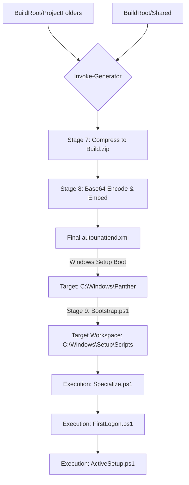

# PowerShell Autounattend.xml Generator

A high-performance, 12-stage orchestration pipeline designed to generate advanced, self-extracting `autounattend.xml` files for Windows deployment. This tool automates the bundling of multiple PowerShell projects, configuration scripts, and binary assets into a single, portable deployment file.

## ✨ Key Features

*   **Binary-to-XML Embedding**: Compresses your entire build environment into a ZIP and embeds it as a Base64 string directly within the XML.
*   **Self-Extraction Engine**: Built-in PowerShell `ExtractScript` within the XML template automatically unpacks your payload during the Windows `Specialize` pass.
*   **Deterministic Execution**: Orchestrates commands across multiple projects using a strict `Order` system.
*   **Multi-Phase Support**: Native orchestration for `Specialize`, `FirstLogonCommands`, and **Active Setup** (per-user profile initialization).
*   **Modern Bypasses**: Automated registry injections to bypass **TPM 2.0**, **Secure Boot**, and **RAM** requirements for Windows 11.
*   **Safe Manifest Loading**: Uses `Import-PowerShellDataFile` to prevent arbitrary code execution during the generation process.

## 🏗 System Architecture & Data Flow

The following diagram illustrates how local source files are transformed into a functional deployment on the target machine:



## 📂 Project Structure

The generator scans a `BuildRoot` for project folders. Each folder (excluding `Shared`) must contain a `.psd1` manifest matching the folder name exactly.

```text
Build/
├── Shared/             <-- Automatically ignored (use for common drivers/apps)
├── ProjectAlpha/
│   ├── ProjectAlpha.psd1  <-- Manifest
│   └── Setup.ps1
└── ProjectBeta/
    ├── ProjectBeta.psd1
    └── Apps.exe
```

### Project Manifest (`.psd1`)
The manifest defines the execution lifecycle for your project assets.
```powershell
@{
    Commands = @(
        @{
            Pass    = "Specialize"   # Options: Specialize, FirstLogon, ActiveSetup
            Order   = 10             # Sequence within the pass
            Command = "powershell.exe -File .\Setup.ps1"
        },
        @{
            Pass    = "FirstLogon"
            Order   = 5
            Command = "powershell.exe -ExecutionPolicy Bypass -File .\PostInstall.ps1"
        }
    )
}
```

## ⚙️ The 12-Stage Pipeline

1.  **Discover**: Identifies valid project directories based on folder/manifest naming.
2.  **Load**: Ingests manifest data safely via [Import-PowerShellDataFile](https://learn.microsoft.com).
3.  **Validate**: Ensures manifests meet strict schema requirements (Pass, Order, Command).
4.  **Normalize**: Flattens nested project data into a global command list.
5.  **Group**: Categorizes and sorts commands by deployment phase and order.
6.  **Scripting**: Generates the physical `.ps1` scripts for the target OS passes.
7.  **Compress**: Packages the entire build root into `Build.zip`.
8.  **Embed**: Encodes the ZIP into an XML `<File>` node using a CDATA block.
9.  **Bootstrap**: Generates the target-side extraction and execution logic.
10. **XML Gen**: Produces fragments for `RunSynchronous`, `FirstLogon`, and `Registry`.
11. **Assemble**: Injects fragments and the embedded payload into the `Template.xml`.
12. **Finalize**: Writes the production-ready `autounattend.xml` to the output folder.

## 🛠 Usage

Execute the entry point with your desired environment paths:

```powershell
.\Main.ps1 -BuildRoot "C:\MyBuild" -OutputFolder "C:\Export"
```

### Parameters

| Parameter | Description | Default |
| :--- | :--- | :--- |
| `-BuildRoot` | Path to your source projects folder. | `C:\Build` |
| `-OutputFolder` | Destination for the generated `autounattend.xml`. | `C:\Out` |
| `-TemplatePath` | Path to the base XML template. | `.\Template.xml` |
| `-WorkspacePath` | Destination path on the target OS. | `C:\Windows\Setup\Scripts` |

## ❓ Troubleshooting & FAQ

**Q: My scripts aren't running on the target machine.**  
**A:** Check `C:\Windows\Panther\unattend.xml` on the target to ensure injection was successful. The generator uses `-ExecutionPolicy Bypass`, but ensure no Domain GPOs are overriding local execution settings.

**Q: The generated XML file is very large.**  
**A:** Because the binary payload is Base64 encoded, the XML size increases by ~33% relative to the ZIP size. Keep the `BuildRoot` lean to avoid hitting extremely large file limits (though several hundred MBs is usually fine).

**Q: How do I handle drivers or large installers?**  
**A:** Place drivers in a folder and reference them in the `Specialize` pass via `pnputil /add-driver`. For large installers, consider the `FirstLogon` pass.

## 📝 Prerequisites
*   **PowerShell 5.1+**
*   **Administrator Privileges** for local generation.
*   Consult the official [Microsoft Unattend Reference](https://learn.microsoft.com) for advanced configuration.

## License
**MIT License**

Copyright (c) 2024

Permission is hereby granted, free of charge, to any person obtaining a copy of this software and associated documentation files (the "Software"), to deal in the Software without restriction, including without limitation the rights to use, copy, modify, merge, publish, distribute, sublicense, and/or sell copies of the Software, and to permit persons to whom the Software is furnished to do so, subject to the following conditions:

The above copyright notice and this permission notice shall be included in all copies or substantial portions of the Software.
